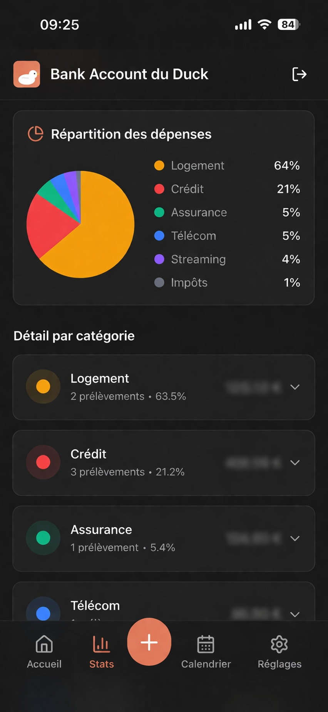
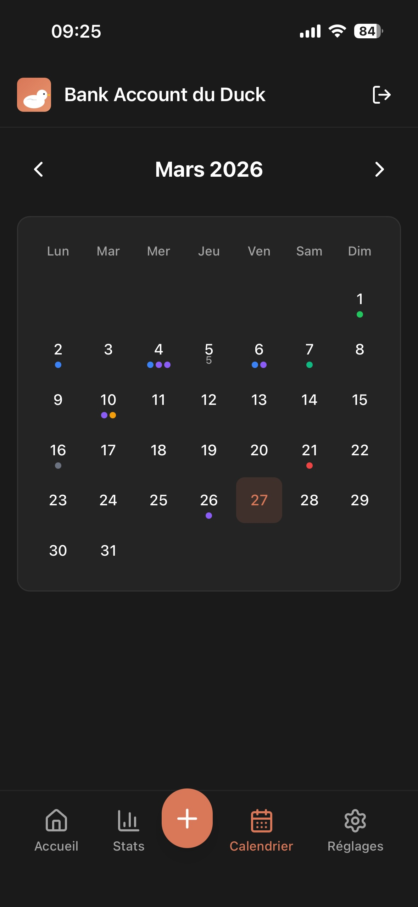
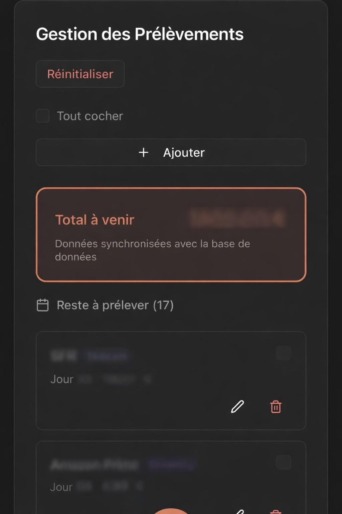
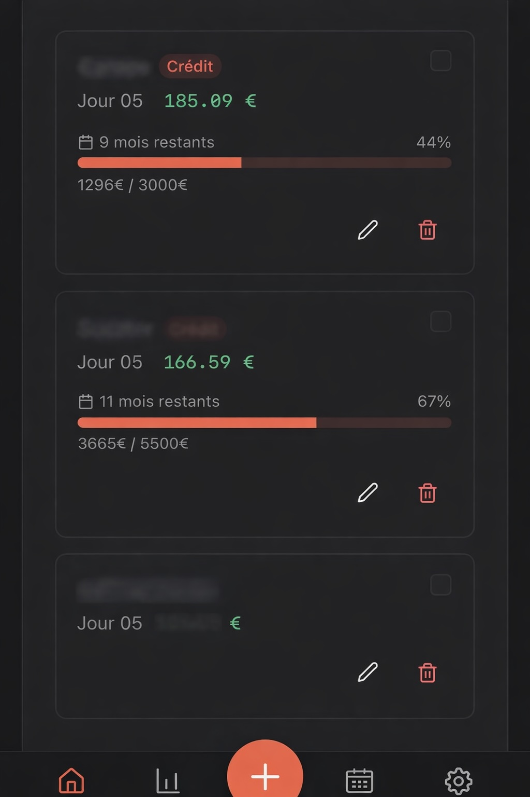
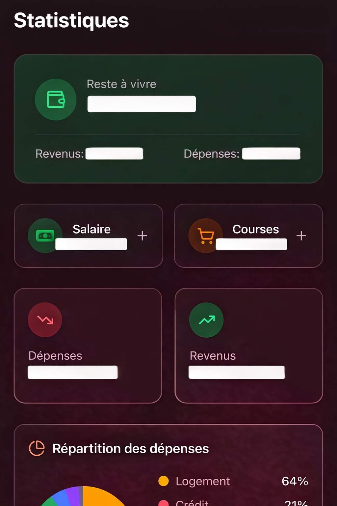

# Bank Account du Duck

> A web app to manage recurring bank debits — subscriptions, rent, loans, taxes — with a clear overview of your monthly expenses.


---

## Screenshots

<p align="center">
  
  &nbsp;&nbsp;&nbsp;&nbsp;
  
</p>

<p align="center">
  
  &nbsp;&nbsp;
  
  &nbsp;&nbsp;
  
</p>

---

## Why this project?

Most banking apps show transaction history, but none give a **clear, interactive overview** of recurring debits. Bank Account du Duck lets you:

- View **all monthly debits** on a single page
- Track what's **already been debited** vs what's **still upcoming**
- Analyze expenses by **category** with detailed statistics
- Browse a **calendar** of upcoming debits
- Work **offline** with PWA mode and automatic sync

---

## Features

### Main Dashboard
- Monthly debit list, split into "upcoming" and "already debited"
- Real-time monthly total overview
- Quick mark as debited (checkbox)
- Full CRUD: add, edit, delete debits

### Statistics
- Expense breakdown by category (telecom, housing, streaming, etc.)
- Detailed view with amounts and percentages
- Income vs expenses tracking
- Custom grocery budget management

### Calendar
- Monthly view with debit day indicators (color-coded dots)
- Month-to-month navigation
- Debit details on day click
- Auto-filtering of expired loans

### Settings
- Database connection status check
- JSON data export
- Light / dark theme
- Real-time connection status

### PWA & Offline
- Install on mobile as a native app
- Offline mode with IndexedDB storage
- Automatic sync when back online

### Authentication
- Secure login via Supabase Auth (email/password)
- Route protection middleware
- Password reset

---

## Tech Stack

| Layer | Technology |
|-------|-----------|
| **Framework** | Next.js 16 (App Router, Turbopack) |
| **UI** | React 19 + TypeScript |
| **Styling** | Tailwind CSS 4 + Radix UI |
| **Database** | PostgreSQL via Neon (serverless) |
| **ORM** | Drizzle ORM |
| **Auth** | Supabase Auth |
| **Validation** | Zod |
| **PWA** | next-pwa + IndexedDB |
| **Icons** | Lucide React |

---

## Architecture

```
app/
  api/
    prelevements/       # CRUD + toggle + reset
    db-status/          # DB health check
    export/             # JSON export
  calendar/             # Calendar view
  stats/                # Category statistics
  settings/             # User settings
  login/                # Authentication

components/
  layout/               # Header, BottomNav, PageLayout
  ui/                   # Design system (Button, Card, Dialog, etc.)

db/
  schema.ts             # Drizzle schema (prelevements table)
  seed.ts               # Demo data

lib/
  categories.ts         # Categories and colors
  routes.ts             # Route constants
  offline-db.ts         # IndexedDB for offline mode
  supabase/             # Supabase clients (client + server)

hooks/
  useOfflineSync.ts     # Offline sync hook
```

---

## Data Model

### `prelevements` table

| Column | Type | Description |
|--------|------|-------------|
| `id` | `serial` | Primary key |
| `title` | `text` | Debit name |
| `day` | `integer` | Day of month (1-31) |
| `amount` | `real` | Amount (negative = income) |
| `category` | `text` | Category |
| `completed` | `boolean` | Debited this month |
| `end_date` | `timestamp` | End date (loans) |
| `total_amount` | `real` | Total loan amount |
| `created_at` | `timestamp` | Creation date |
| `updated_at` | `timestamp` | Last update |

**9 categories**: telecom, housing, streaming, insurance, transport, loan, tax, income, other

---

## Getting Started

### Prerequisites

- Node.js 18+
- A [Neon](https://neon.tech) account (serverless PostgreSQL)
- A [Supabase](https://supabase.com) project (authentication)

### Setup

```bash
# Clone the repository
git clone https://github.com/decuyperanthony/bank-account-du-duck.git
cd bank-account-du-duck

# Install dependencies
npm install

# Configure environment variables
cp .env.example .env.local
# Fill in DATABASE_URL, NEXT_PUBLIC_SUPABASE_URL, NEXT_PUBLIC_SUPABASE_ANON_KEY

# Push schema to database
npx drizzle-kit push

# (Optional) Seed with demo data
npx tsx db/seed.ts

# Start development server
npm run dev
```

Open [http://localhost:3000](http://localhost:3000) to see the app.

---

## Scripts

| Command | Description |
|---------|-------------|
| `npm run dev` | Dev server (Turbopack) |
| `npm run build` | Production build |
| `npm run lint` | ESLint |
| `npm run db:push` | Push schema to DB |
| `npm run db:seed` | Seed demo data |
| `npm run db:studio` | Drizzle Studio GUI |
| `npm run generate:pwa` | Generate PWA icons |

---

## License

MIT
